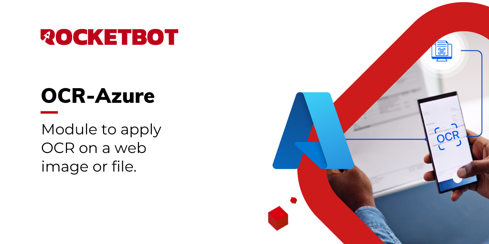

# OCR Azure
  
Module to apply OCR on a web image or file  

*Read this in other languages: [English](Manual_OCR-Azure.md), [Português](Manual_OCR-Azure.pr.md), [Español](Manual_OCR-Azure.es.md)*
  

## How to install this module
  
To install the module in Rocketbot Studio, it can be done in two ways:
1. Manual: __Download__ the .zip file and unzip it in the modules folder. The folder name must be the same as the module and inside it must have the following files and folders: \__init__.py, package.json, docs, example and libs. If you have the application open, refresh your browser to be able to use the new module.
2. Automatic: When entering Rocketbot Studio on the right margin you will find the **Addons** section, select **Install Mods**, search for the desired module and press install.  

## How to use this module
Before using this module, you need an Azure account: https://portal.azure.com

This module supports 3 operations:
1. GetOCR (Computer Vision OCR v1.0)
2. GetReadOCR (Computer Vision Read v3.2)
3. AnalyzeDocument (Azure Document Intelligence)

### 1) Azure setup

#### A. For GetOCR and GetReadOCR (Computer Vision)
1. Go to Azure Portal.
2. Create a Computer Vision (or Azure AI Vision) resource.
3. Save these values:
   - API Key
   - Region
   - Endpoint

#### B. For AnalyzeDocument (Document Intelligence)
1. Go to Azure Portal.
2. Create a Document Intelligence resource.
3. Save these values:
   - API Key
   - Region
   - Endpoint

### 2) Rocketbot command configuration

#### GetOCR
Use this command to extract text from an image URL or local image path using classic OCR.

Required fields:
- image_path: Local image path or URL.
- api_key: Computer Vision API key.
- region: Azure region of the resource.
- result: Rocketbot variable where output is stored.

Output:
- The result variable stores the full JSON response.
- textAnnotation contains extracted plain text.

#### GetReadOCR
Use this command to extract text from image URL or local image path using async Read API.

Required fields:
- image_path: Local image path or URL.
- api_key: Computer Vision API key.
- region: Azure region of the resource.
- result: Rocketbot variable where output is stored.

Optional fields:
- language: Language hint (example: en, es).
- timeout: Max wait time in seconds (default: 60).
- poll_interval: Polling interval in seconds (default: 1).

Output:
- The result variable stores the operation JSON.
- textAnnotation contains extracted plain text from lines.

#### AnalyzeDocument
Use this command to analyze PDF/image documents with Document Intelligence.

Required fields:
- source: Local file path or URL (PDF or image).
- api_key: Document Intelligence API key.
- region: Azure region of the resource.
- model_id: Model ID (example: prebuilt-read, prebuilt-
layout, prebuilt-document).
- result: Rocketbot variable where output is stored.

Optional fields:
- api_version: API version (default: 2023-07-31).
- pages: Pages to analyze (example: 1, 1-3, 1,3,5).
- locale: Locale hint (example: en-US, es-ES, pt-BR).
- timeout: Max wait time in seconds (default: 60).
- poll_interval: Polling interval in seconds (default: 1).

Output:
- The result variable stores the operation JSON.
- textAnnotation contains full extracted text when available.

### 3) Notes and recommendations
- Verify that region and key belong to the same Azure resource.
- For local files, make sure Rocketbot can access the file path.
- If you get timeout errors, increase timeout and/or poll_interval.
- For PDFs and structured documents, prefer AnalyzeDocument.

## Description of the commands

### OCR azure convert file
  
Extract text from file.
|Parameters|Description|example|
| --- | --- | --- |
|Image||Image file or url|
|Input your key||API Key|
|Select Region|||
|Result||{result}|

### Computer Vision READ
  
Extracts text from an image in a more modern and accurate way than classic OCR.
|Parameters|Description|example|
| --- | --- | --- |
|Image|File Path or url of the image |Image file or url|
|Input your key|Obtain your key on https//portal.azure.com|API Key|
|Select Region|Select region||
|Language|Language of the text to recognize. Leave empty for automatic detection when applicable.|en|
|Timeout|Maximum time to wait for the operation to complete.|60|
|Poll interval|Number of seconds between each analysis status check.|1|
|Result|Variable where the result is stored without {}|{result}|

### Document Intelligence
  
Analyzes complete documents.
|Parameters|Description|example|
| --- | --- | --- |
|Document|Local path or URL of the document to analyze. Can be PDF or image.|C:/files/invoice.pdf or https://...|
|Input your key|API Key of the Azure Document Intelligence resource.|API Key|
|Select Region|Select the region where the Azure Document Intelligence resource was created.||
|Model|ID of the model to use. It can be a prebuilt model or a custom model. Prebuilt models include 'prebuilt-read' for OCR, 'prebuilt-layout' for layout analysis, and 'prebuilt-document' for general document analysis.|prebuilt-read|
|API Version|Document Intelligence API version. If left empty, the module default value will be used.|2023-07-31|
|Pages|Pages to analyze. You can indicate a single page, multiple pages, or a range. For example '1', '1,3,5', or '1-5'. If left empty, all pages will be analyzed.|1-3|
|Locale|Locale of the document. Useful to improve interpretation based on language or format.|en-US|
|Timeout|Maximum time to wait for the operation to complete.|60|
|Poll interval|Number of seconds between each analysis status check.|1|
|Result|Variable where the result is stored without {}|{result}|
